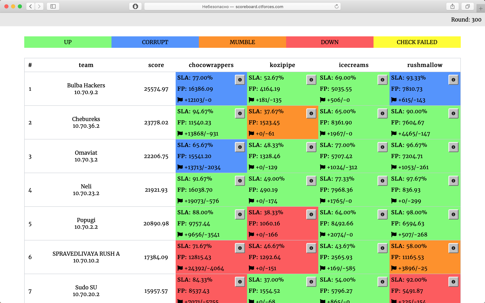

# Attack-Defence training by C4T BuT S4D

Sources of services, checkers and sploits from 27th October 2019 training.

## Results

[Full scoreboard](scoreboard/full.png)

## Services

| Service | Lang | Checker | Sploits | Author |
|--------|------|-------|---------|-------|
| **[chocowrappers](services/chocowrappers/)** | C# | [Checker](checkers/chocowrappers/) | [Sploits](sploits/chocowrappers/) | [@pomo_mondreganto](https://github.com/pomo-mondreganto) |
| **[icecreams](services/icecreams/)** | PascalABC | [Checker](checkers/icecreams/) | [Sploits](sploits/icecreams/) | [@jnovikov](https://github.com/jnovikov) |
| **[rushmallow](services/rushmallow/)** | F# | [Checker](checkers/rushmallow/) | [Sploits](sploits/rushmallow/) | [@keltecc](https://github.com/keltecc) |
| **[kozipipe](services/kozipipe/)** | IronPython | [Checker](checkers/kozipipe/) | [Sploits](sploits/kozipipe/) | [@kekov](https://github.com/xmikasax) |

## Image

- mono in Docker

## Infrastructure

- DevOps: author [@pomo-mondreganto](https://github.com/pomo-mondreganto), performer [@xmikasax](https://github.com/xmikasax).
- Checksystem: [ForcAD](https://github.com/pomo-mondreganto/ForcAD)

## Writeups

Coming...
